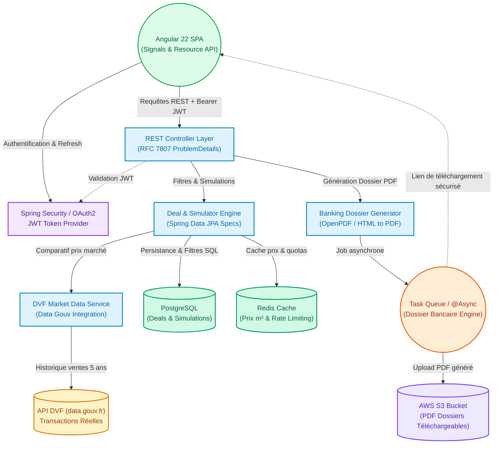

# 🏢 ImmoManager — Smart Real Estate Deal Finder & Investment Simulator

[](https://openjdk.org/)
[](https://spring.io/projects/spring-boot)
[](https://angular.dev/)
[](https://tailwindcss.com/)
[](https://docs.docker.com/compose/)
[](LICENSE)

> **ImmoManager** est une plateforme SaaS d'analyse d'opportunités et d'optimisation d'investissements locatifs. Elle permet aux investisseurs particuliers, chasseurs immobiliers et conseillers en gestion de patrimoine de filtrer des opportunités réelles à haut rendement, de comparer les prix du marché avec les données officielles de l'État (**API DVF**), de simuler l'impact fiscal (LMNP Réel, Micro-BIC, SCI IS, Nu), et de générer un **dossier bancaire PDF complet** prêt à présenter aux établissements de crédit.

---

## 🏛️ Architecture & Conception Système



> 📌 *Une version statique haute résolution du schéma est également disponible dans le dossier de documentation :*  
> `docs/immo_schema.png`

---

## ⚡ Démarrage Rapide (1 seule commande avec Docker)

Le projet est entièrement conteneurisé. Pour démarrer la base PostgreSQL, l'API Spring Boot et l'application frontend Angular en une seule commande :

```bash
docker compose up --build
```

Une fois les conteneurs démarrés :
- 🌐 **Frontend (Angular)** : [http://localhost:4200](http://localhost:4200)
- ⚙️ **Backend API (Spring Boot)** : [http://localhost:8080/api/deals](http://localhost:8080/api/deals)
- 🗄️ **PostgreSQL** : `localhost:5432` (Base : `immomanager`, User : `immomanager`, Mot de passe : `immomanager_secret`)

Pour arrêter l'ensemble :
```bash
docker compose down
```

---

## 🛠️ Stack Technique

### Backend
- **Langage & Runtime** : Java 25 & Spring Boot 4.1.0
- **Persistance** : Spring Data JPA, PostgreSQL (production/docker) & SQLite (dev local autonome)
- **Architecture** : Clean Architecture, DTOs sous forme de `record` Java 25, RFC 7807 `ProblemDetail`
- **Cloud Ready** : Plugin GraalVM Native Image pour un démarrage ultra-rapide (< 50ms) et AWS Serverless Container

### Frontend
- **Framework** : Angular 22 (Standalone components, Signals, Signal Forms, Resource API)
- **Styling** : Tailwind CSS v4 & SCSS
- **Qualité & Tests** : Vitest (unitaires) & Playwright (E2E)

---

## 💻 Développement Local Sans Docker (Optionnel)

### 1. Démarrer le Backend
```bash
cd backend
./mvnw spring-boot:run
```
*(Utilise par défaut SQLite en local, aucun prérequis de base de données à installer).*

### 2. Démarrer le Frontend
```bash
cd frontend
npm install
npm start
```
L'application se lance sur `http://localhost:4200` avec proxy automatique des appels `/api` vers le backend.

---

## 📑 Spécifications Produit & Roadmap

Retrouvez le cahier des charges complet, l'analyse de valeur SaaS et la grille d'évaluation pour recruteurs dans le document dédié :

👉 **[Consulter le PRD (Product Requirements Document)](docs/PRD.md)**

Le PRD inclut des **cases à cocher dynamiques** pour suivre l'avancement des 3 phases du projet :
- [ ] **Phase 1** : Rigueur Architecturale, Moteur Fiscal Réel & API DVF de l'État
- [ ] **Phase 2** : Générateur de Dossier Bancaire PDF & Data Visualisation interactive
- [ ] **Phase 3** : Sécurité JWT, Multi-tenancy, Infrastructure as Code (AWS/Terraform) & CI/CD
