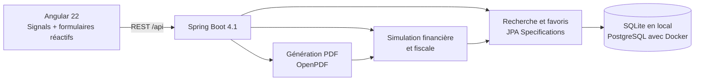

# ImmoRadar — Investment cockpit

[](https://openjdk.org/)
[](https://spring.io/projects/spring-boot)
[](https://angular.dev/)
[](https://github.com/Hugo-Delattre/ImmoManager/actions/workflows/ci.yml)
[](LICENSE)

ImmoRadar est une application full-stack qui transforme une annonce immobilière en décision d'investissement : recherche multicritère, favoris, simulation de financement et de fiscalité, projection patrimoniale à long terme et dossier PDF partageable.


## Ce qui fonctionne aujourd'hui

- cockpit responsive avec états de chargement et d'erreur, navigation clavier et contraste soigné ;
- recherche paginée côté serveur par localisation, prix, rendement, cash-flow et favoris ;
- ajout d'une opportunité et gestion persistante des favoris ;
- indicateurs calculés : rendement brut/net, mensualité, cash-flow, fiscalité et loyer d'équilibre ;
- scénarios `LMNP réel`, `Micro-BIC`, `location nue` et `SCI à l'IS` ;
- hypothèses de vacance, gestion, assurance, progression des loyers et valeur du bien ;
- projection annuelle sur 20 ou 25 ans ;
- exploration des projections par année, trois indicateurs et tableau accessible ;
- génération à la demande d'un dossier d'investissement PDF de deux pages ;
- démonstration locale immédiatement exploitable grâce aux données d'exemple et à SQLite.

Un [exemple de dossier PDF](output/pdf/dossier-investissement-exemple.pdf) est versionné pour permettre d'évaluer le rendu sans lancer l'application.

## Architecture



Le découpage par domaines (`deal`, `simulation`, `report`) garde les règles financières testables indépendamment de l'interface. Les montants sont manipulés en `BigDecimal`, et les filtres sont exécutés en base plutôt que dans le navigateur.

## Démarrage rapide avec Docker

```bash
docker compose up --build
```

- application : [http://localhost:4200](http://localhost:4200)
- API : [http://localhost:8080/api/deals](http://localhost:8080/api/deals)
- PostgreSQL : `localhost:5432`

Pour arrêter l'ensemble :

```bash
docker compose down
```

## Développement local

Prérequis : Java 25 et Node.js 22+.

```bash
cd backend
./mvnw spring-boot:run
```

Dans un second terminal :

```bash
cd frontend
npm ci
npm start
```

Le frontend utilise son proxy de développement vers `http://localhost:8080`. SQLite est créé automatiquement côté backend.

## Qualité

```bash
# Backend
cd backend
./mvnw test

# Frontend
cd frontend
npm run build
npm test -- --watch=false
npx playwright test --project=chromium
```

La CI GitHub vérifie le build Angular, les tests Vitest et les tests Spring. Playwright couvre les interactions de recherche, pagination, simulation et téléchargement avec une API contrôlée. Les tests navigateur connectés au véritable backend restent à automatiser.

Pour apprendre en lisant le code : [parcours Angular et décisions d'architecture](docs/ANGULAR_ARCHITECTURE.md). La [roadmap](docs/PRD.md) distingue les fonctionnalités livrées, partielles et restantes.

## Suite produit

Les prochains lots à plus forte valeur sont l'import d'annonces, le comparatif avec les données DVF, l'authentification multi-utilisateur et la sauvegarde de plusieurs scénarios par bien. Le périmètre cible et les décisions produit sont détaillés dans le [PRD](docs/PRD.md).

> Les calculs et documents générés sont des aides à la décision, pas des conseils fiscaux ou financiers.
