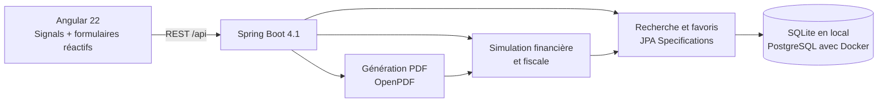

# ImmoRadar — Investment cockpit

[](https://openjdk.org/)
[](https://spring.io/projects/spring-boot)
[](https://angular.dev/)
[](https://github.com/Hugo-Delattre/ImmoRadar/actions/workflows/ci.yml)
[](LICENSE)

ImmoRadar est une application full-stack qui transforme une annonce immobilière en décision d'investissement : recherche multicritère, favoris, simulation de financement et de fiscalité, projection patrimoniale à long terme et dossier PDF partageable.


## Ce qui fonctionne aujourd'hui

- cockpit responsive avec états de chargement et d'erreur, navigation clavier et contraste soigné ;
- recherche paginée côté serveur par localisation, prix, rendement, cash-flow et favoris ;
- analyseur d'annonces en 1 clic par URL (support démo instantané Leboncoin, SeLoger, PAP) ;
- intelligence de marché DVF (data.gouv.fr) : prix médian au m² du quartier, écart de valorisation, marge de négociation et score de liquidité ;
- comparateur fiscal multi-régimes (`LMNP réel`, `Micro-BIC`, `location nue`, `SCI à l'IS`) avec détection automatique du régime optimal ;
- jauge de taux d'effort bancaire (règle HCSF des 35% d'endettement) ;
- métriques financières institutionnelles : **TRI (Taux de Rentabilité Interne)** calculé par Newton-Raphson et **VAN (Valeur Actuelle Nette à 4%)** ;
- projection patrimoniale annuelle sur 15, 20 ou 25 ans avec exploration interactive ;
- génération à la demande d'un dossier bancaire PDF professionnel complet prêt pour le courtier ;
- démonstration locale immédiatement exploitable grâce aux données d'exemple et à SQLite.

## 🎯 Démo Recruteur en 3 minutes (Pitch & Démonstration)

Pour présenter le projet lors d'un entretien technique ou produit :

1. **Import en 1 clic d'une annonce réelle** : Cliquer sur *« Analyser une annonce »*, coller l'URL Leboncoin de test (`https://www.leboncoin.fr/ad/ventes_immobilieres/3271114816`). Constater le préremplissage automatique des données (Maison 74 m² au Havre, 180 000 €, loyer estimé 950 €).
2. **Intelligence de marché DVF** : Visualiser le widget DVF comparant le bien au prix médian notarié de la commune, avec l'écart en %, la marge de négociation suggérée et l'indice de liquidité.
3. **Moteur fiscal & règle HCSF** : Observer le comparateur fiscal dynamique côte à côte avec le badge du régime le plus avantageux (`LMNP Réel` grâce à l'amortissement comptable) et la jauge d'endettement bancaire (HCSF 35%).
4. **Métriques institutionnelles TRI & VAN** : Montrer les indicateurs institutionnels utilisés par les fonds d'investissement (TRI sur 20 ans avec sortie en plus-value et VAN actualisée à 4%).
5. **Dossier bancaire PDF** : Cliquer sur *« Télécharger le dossier bancaire »* pour générer instantanément le PDF de synthèse financière.
6. **Architecture & Tests** : Mentionner la stack moderne (Java 25, Spring Boot 4.1, Angular 22 Signals, Playwright E2E, suite Terraform 9 modules).

Un [exemple de dossier PDF](output/pdf/dossier-investissement-exemple.pdf) est versionné pour permettre d'évaluer le rendu sans lancer l'application.

## Architecture



Le découpage par domaines (`deal`, `simulation`, `report`) garde les règles financières testables indépendamment de l'interface. Les montants sont manipulés en `BigDecimal`, et les filtres sont exécutés en base plutôt que dans le navigateur.

## Démarrage rapide avec Docker

```bash
docker compose up --build
```

- Cockpit Web : [http://localhost:4200](http://localhost:4200)
- API Backend : [http://localhost:8080/api/deals](http://localhost:8080/api/deals)
- Base PostgreSQL : `localhost:5432`

> **Note :** Aucune authentification n'est requise et la base de données est **automatiquement alimentée** au démarrage avec 5 opportunités réelles via le `DatabaseSeeder`.

Pour arrêter l'ensemble :

```bash
docker compose down
```

## 🧪 Étapes pas à pas pour tester l'application

Voici le parcours complet pour tester l'ensemble des fonctionnalités en 2 minutes :

### Étape 1 : Découvrir le catalogue de biens (Recherche & Filtres)
1. Ouvrez [http://localhost:4200](http://localhost:4200) dans votre navigateur.
2. Les 5 biens pré-enregistrés s'affichent automatiquement (Saint-Étienne, Limoges, Mulhouse, Le Mans, Belfort).
3. Testez les filtres réactifs dans la barre latérale :
   - Ajustez le prix max ou le rendement minimum pour voir la pagination et le filtrage serveur JPA en action.
   - Cliquez sur l'étoile ★ d'un bien pour le basculer en favori (persistance immédiate en base).

### Étape 2 : Lancer un scan / extraire une annonce par URL
1. Cliquez sur le bouton **« Analyser une annonce »** (en haut de la liste de biens).
2. Une modale s'ouvre : collez l'URL d'une annonce réelle, par exemple :
   ```
   https://www.leboncoin.fr/ad/ventes_immobilieres/3271114816
   ```
   *(ou cliquez sur l'un des boutons de raccourci démo Leboncoin, SeLoger, PAP)*.
3. Cliquez sur **« Extraire »** : l'extracteur analyse l'URL et préremplit instantanément le formulaire (Maison 74 m² au Havre, 180 000 €, loyer estimé 950 €, photo).
4. Cliquez sur **« Enregistrer et analyser »** : le bien est persisté en base de données et sélectionné automatiquement pour l'analyse.

### Étape 3 : Vérifier l'intelligence de marché DVF (data.gouv.fr)
1. Dans le volet droit de l'écran, consultez la section **« 01 Intelligence de marché DVF »**.
2. Observez le comparatif avec les transactions notariées réelles des 5 dernières années dans le secteur :
   - Prix DVF médian au m² et fourchette min/max.
   - Écart en % vs le marché (+/-).
   - Offre conseillée et marge de négociation recommandée.
   - Indice de tension et score de liquidité.

### Étape 4 : Ajuster le simulateur & observer le comparateur fiscal
1. Dans la section **« 02 Studio de financement »**, modifiez l'apport avec les boutons rapides (`0% (Sans apport)`, `10%`, `15%`, `20%`).
2. Observez la réactivité instantanée du serveur :
   - **Cash-flow mensuel net** après charges, crédit et impôts.
   - **Indicateurs institutionnels** : **TRI (IRR)** sur 20 ans avec sortie en plus-value et **VAN (NPV à 4%)**.
   - **Jauge d'endettement HCSF** (alerte visuelle si le taux d'effort dépasse 35%).
   - **Comparateur fiscal 4 régimes** (LMNP Réel, Micro-BIC, Location Nue, SCI à l'IS) indiquant le régime fiscal optimal avec le badge vert **« Recommandé »**.
3. Dans la courbe patrimoniale, survolez ou cliquez sur les années (1, 5, 10, 15, 20 ans) pour visualiser l'amortissement du capital vs enrichissement net.

### Étape 5 : Télécharger le dossier bancaire PDF
1. Cliquez sur le bouton vert **« Télécharger le dossier bancaire »** (en haut à droite ou en bas du simulateur).
2. Le backend génère et télécharge immédiatement un document PDF professionnel de 2 pages prêt pour un courtier ou une banque (synthèse de l'opération, plan de financement, frais de notaire, ratio HCSF, tableau d'amortissement et métriques TRI/VAN).

## Développement local

Prérequis : Java 25 et Node.js 22+.

```bash
cd backend
./mvnw spring-boot:run
```

Dans un second terminal :

```bash
cd frontend
npm ci
npm start
```

Le frontend utilise son proxy de développement vers `http://localhost:8080`. SQLite est créé automatiquement côté backend.

## Qualité

```bash
# Backend
cd backend
./mvnw test

# Frontend
cd frontend
npm run build
npm test -- --watch=false
npx playwright test --project=chromium
```

La CI GitHub vérifie le build Angular, les tests Vitest et les tests Spring. Playwright couvre les interactions de recherche, pagination, simulation et téléchargement avec une API contrôlée. Les tests navigateur connectés au véritable backend restent à automatiser.

Pour apprendre en lisant le code : [parcours Angular et décisions d'architecture](docs/ANGULAR_ARCHITECTURE.md). La [roadmap](docs/PRD.md) distingue les fonctionnalités livrées, partielles et restantes.

## Suite produit

Les prochains lots à plus forte valeur sont l'import d'annonces, le comparatif avec les données DVF, l'authentification multi-utilisateur et la sauvegarde de plusieurs scénarios par bien. Le périmètre cible et les décisions produit sont détaillés dans le [PRD](docs/PRD.md).

> Les calculs et documents générés sont des aides à la décision, pas des conseils fiscaux ou financiers.
