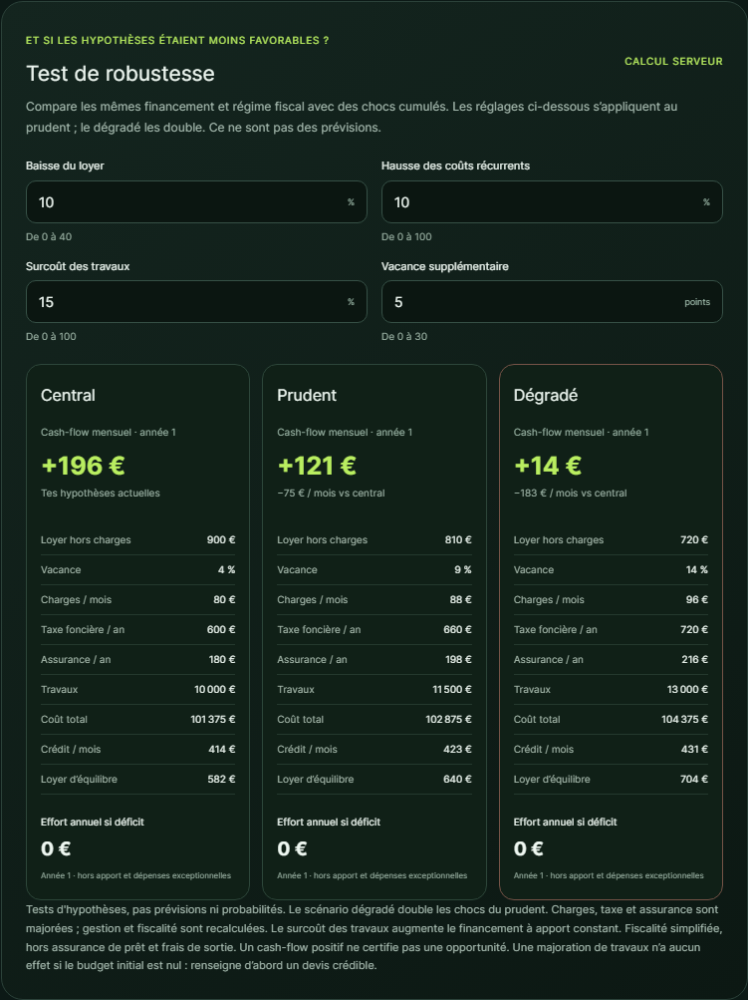

# ImmoRadar

ImmoRadar est un cockpit local d'analyse d'investissements immobiliers : catalogue filtrable, saisie de biens, simulation, comparaison de marché et export PDF. Le front Angular et l'API Spring Boot sont dans ce dépôt.


## État réel du produit

- [x] Recherche paginée, favoris et sauvegarde des biens dans la base locale.
- [x] Formulaire de saisie permettant d'analyser une véritable annonce après vérification manuelle des données.
- [x] Extraction **opportuniste** des métadonnées publiques d'une URL Leboncoin, SeLoger ou PAP. Si le portail bloque l'accès, ou si prix/surface manquent, l'import échoue explicitement ; l'utilisateur peut saisir le bien manuellement. Loyer, charges, taxe et travaux ne sont jamais inventés.
- [x] Référence de marché par commune et tranche de surface, à partir d'agrégats de transactions DVF publiés par [FoncierData](https://foncierdata.fr/methodologie) ; millésime, taille d'échantillon et source sont visibles. Aucune conclusion si la donnée manque ou si l'échantillon est inférieur à 20 ventes. Ce n'est **pas** une expertise au niveau du quartier ou du bien.
- [x] Affichage de jusqu'à cinq [ventes DVF récentes](https://foncierdata.fr/api), proches en type et surface, récupérées en direct parmi les 20 dernières publiées pour la commune. Ce sous-ensemble illustre le marché ; il ne sert pas au calcul de la médiane et n'est pas représentatif à lui seul.
- [x] Simulation de crédit, charges, vacance, cash-flow et projections selon les hypothèses saisies ; loyer d'équilibre recalculé avec charges variables et fiscalité simulée.
- [x] Comparaison **indicative** de quatre hypothèses fiscales, TRI et VAN bruts, export PDF d'aide à la décision.
- [x] Tests Java, tests Angular et tests Playwright à API simulée.
- [x] Dossier de fiabilité par bien : dix contrôles persistés, observations séparées des estimations, notes, références HTTPS et dates. Le compteur reflète tes justificatifs déclarés, pas une vérification indépendante.
- [x] Test de robustesse central/prudent/dégradé : chocs modifiables sur loyer, vacance, coûts récurrents et travaux ; recalcul du crédit à apport constant, écart de cash-flow et effort annuel si déficit. Ce sont des hypothèses exploratoires, pas des loyers de marché ni des probabilités.
- [ ] Collecte automatique fiable et durable des annonces : dépend de l'accès autorisé aux portails ou d'une autre source contractuelle.
- [ ] Estimation du loyer par comparables vérifiés, assurance emprunteur, frais de cession, plus-value, fiscalité personnelle et capacité bancaire.
- [x] Premier test navigateur full-stack isolé : création d'un bien, calcul réel de robustesse, relecture après rechargement ; job CI dédié. Le marché externe est exclu de ce test hors ligne.
- [ ] Authentification, isolation des données utilisateurs, migrations de base et couverture full-stack étendue (redémarrage backend, comparaison PDF).

Les cinq biens chargés au démarrage sont des **exemples fictifs**. Leur prix, loyer et rendement ne sont pas des opportunités vérifiées. Aucune annonce ni offre d'achat ne doit être retenue sans vérifier la source, l'état du bien, les diagnostics, les loyers comparables et les coûts réels.

## Démonstration

1. Démarrer l'application puis filtrer le catalogue et inspecter un exemple.
2. Ajouter un **vrai bien** via le formulaire. Coller éventuellement l'URL source : si les métadonnées sont accessibles, elles préremplissent uniquement les champs observés. Compléter le loyer, les charges, la taxe, les travaux et la localisation après vérification.
3. Lire le comparatif communal : année, nombre de transactions, ventes récentes et liens vers les JSON sources. « Indisponible » est un résultat normal si l'échantillon n'est pas suffisant ou si la source externe ne répond pas.
4. Dans « Fiabilité du dossier », renseigner les références et dates de contrôle. Seuls les justificatifs renseignés (ou une copropriété explicitement non applicable) complètent le dossier. Une estimation reste à confirmer ; la disponibilité est à recontrôler après 30 jours. Il s'agit d'une règle de fraîcheur du produit, pas d'une norme réglementaire.
5. Faire varier l'apport, le taux et les hypothèses. Le cash-flow et le loyer d'équilibre sont recalculés côté serveur. Dans « Test de robustesse », comparer les trois scénarios et ajuster les chocs du prudent ; le dégradé les double. Un budget travaux nul reste nul même après majoration : saisir un devis crédible est indispensable. Le déficit annualisé reflète l'année 1, hors apport et dépenses exceptionnelles. Ces réglages ne sont pas encore sauvegardés ni exportés dans le PDF.
6. Télécharger le PDF, puis expliquer ses limites : fiscalité simplifiée, revente brute, absence de validation de la capacité d'emprunt. Les notes de justificatifs restent dans l'interface et ne sont pas encore incluses dans le PDF.

L'architecture Angular (signals, Signal Forms, ressources, états d'erreur) est expliquée dans [le guide Angular](docs/ANGULAR_ARCHITECTURE.md). Les priorités restantes sont dans [la roadmap](docs/PRD.md).

## Démarrage

Avec Docker :

```bash
docker compose up --build
```

Interface : http://localhost:4200 — API : http://localhost:8080/api/deals. La configuration Docker utilise PostgreSQL ; le lancement local du backend utilise SQLite. L'application n'a pas encore d'authentification : ne pas l'exposer publiquement telle quelle.

En local, avec Java 25, Maven, Node.js et npm :

```bash
cd backend
mvn spring-boot:run
```

Dans un autre terminal :

```bash
cd frontend
npm ci
npm start
```

Le proxy Angular transmet les appels `/api` au backend local.

## Vérification

```bash
cd backend
mvn test
```

Pour vérifier **les vraies API externes** depuis PowerShell (réseau requis ; ce test est exclu des tests hors ligne) :

```powershell
cd backend
$env:IMMORADAR_LIVE_API_TEST = 'true'
mvn -Dtest=MarketLiveApiTests test
Remove-Item Env:IMMORADAR_LIVE_API_TEST
```

Ce test vérifie la résolution de Limoges par [l'API Geo officielle](https://geo.api.gouv.fr/decoupage-administratif/communes), la médiane et les ventes individuelles via [l'API publique FoncierData](https://foncierdata.fr/api). Pour vérifier la chaîne jusqu'au front, démarrez le backend et le frontend puis ouvrez un appartement d'exemple à Limoges : le panneau marché doit afficher les ventes et le lien « Voir le JSON source ». L'endpoint du backend est `GET /api/market/deals/2/dvf` sur une base fraîche contenant les cinq exemples ; l'identifiant peut différer avec une base existante.

Un test navigateur **non simulé** est aussi disponible. Démarrez `mvn spring-boot:run` dans `backend` avec une base contenant l'exemple de Limoges, puis dans un autre PowerShell :

```powershell
cd frontend
$env:IMMORADAR_LIVE_API_TEST = 'true'
npx playwright test e2e/live-market.spec.ts --project=chromium
Remove-Item Env:IMMORADAR_LIVE_API_TEST
```

Ce test traverse Angular → Spring → API Geo/FoncierData. Il échoue si les sources externes sont inaccessibles, si l'exemple de Limoges n'existe plus ou si le contrat change ; c'est volontaire et c'est pourquoi il reste opt-in.

```bash
cd frontend
npm run build
npm test -- --watch=false
npx playwright test --project=chromium
```

La suite `e2e` utilise des réponses API simulées ; elle vérifie l'interface, pas Spring. Un premier parcours réel, séparé, démarre Angular et Spring avec une base SQLite **en mémoire isolée** :

```bash
cd frontend
npx playwright test --config playwright.fullstack.config.ts
```

Java 25, Maven et npm doivent être accessibles ; les ports 8080 et 4300 doivent être libres. Aucun serveur existant n'est réutilisé. Le test crée un bien fictif par le formulaire, vérifie ses scénarios réellement calculés, l'absence de mutation du loyer et sa relecture après rechargement du navigateur. Il ne prouve pas la persistance après redémarrage du backend ni l'équivalence PDF/API. Seule la consultation du marché externe est simulée. Le job CI dédié exécute ce même parcours ; son résultat distant doit être contrôlé après le push.



Le test réseau opt-in prouve la connexion aux API externes à l'instant de son exécution, pas leur disponibilité future. FoncierData couvre une partie des communes et n'est pas une API officielle de la DGFiP. Les annonces sont des services externes susceptibles d'être indisponibles. Les calculs ne constituent ni conseil fiscal ni offre de financement.
