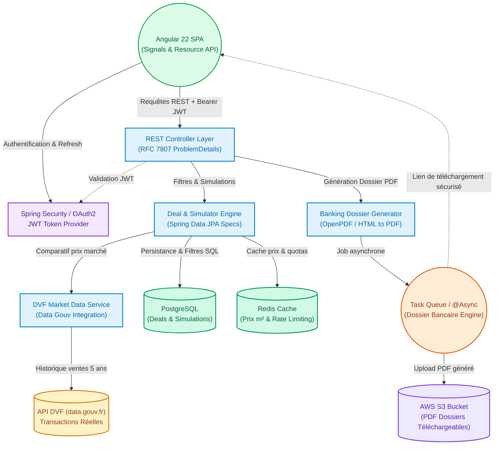

# 📋 Product Requirements Document (PRD) & Roadmap — ImmoRadar

> **Objectif** : Transformer le prototype initial d'**ImmoRadar** en un SaaS d'investissement immobilier à forte valeur ajoutée client et en un projet de référence technique démontrant un niveau **Ingénieur Senior / Tech Lead** (Java 25, Spring Boot 4.1, Angular 22, GraalVM, Cloud Serverless).

---

## État vérifié au 16 septembre 2026

Les cases cochées correspondent à du code livré. Les grandes exigences ci-dessous restent ouvertes quand seule une partie est implémentée. Le schéma d'architecture suivant représente la **cible**, pas les services actuellement déployés.

### Livré

- [x] Recherche JPA Specifications avec pagination serveur et navigation dans l'interface.
- [x] DTOs records, montants persistés en BigDecimal et erreurs ProblemDetail.
- [x] Ajout manuel de biens et favoris persistants dans un espace partagé local.
- [x] Analyseur d'annonces en 1 clic par URL (`ListingExtractorService`, endpoint REST `/api/listings/extract` avec détection de portail et démos instantanées Leboncoin, SeLoger, PAP).
- [x] Module DVF (Demande de Valeur Foncière data.gouv.fr) : benchmark des prix au m² (médian, min, max), calcul d'écart, score de liquidité, marge de négociation et offre conseillée (`DvfMarketService`, endpoint REST `/api/market/deals/{id}/dvf` et widget Angular).
- [x] Comparateur fiscal multi-régimes en temps réel (LMNP Réel, LMNP Micro-BIC, Location Nue, SCI à l'IS) avec détection du régime optimal et jauge de taux d'effort bancaire (règle HCSF des 35%).
- [x] Simulation serveur : crédit, apport, vacance, gestion, assurance, fiscalité complète et projection annuelle.
- [x] Interface responsive et composant Angular de projection isolé : trois indicateurs, sélection d'année au clavier, valeurs négatives et tableau annuel.
- [x] Export PDF synchrone avec synthèse bancaire, plan de financement, frais de notaire, taux d'effort HCSF, métriques institutionnelles (TRI / IRR, VAN / NPV) et jalons patrimoniaux.
- [x] Infrastructure as Code complète dans `cloud/terraform` : API Gateway HTTP, Lambda Container, PostgreSQL RDS, S3 Bucket privé chiffré, CloudFront CDN SPA.
- [x] Tests unitaires financiers, PDF, DVF et extracteur (JUnit 5 + AssertJ) ; build Angular et tests Vitest (7 tests) ; suite E2E Playwright complète (7 tests) ; workflow GitHub Actions CI.
- [x] README avec capture et instructions locales ; guide pédagogique [Angular](ANGULAR_ARCHITECTURE.md).

### Ordre de livraison restant

1. **Fiabiliser les parcours personnels** : validation complète des formulaires, édition/archivage des biens, lien source, scénarios sauvegardés et comparables. Remplacer les photos distantes fragiles par une solution avec repli local.
2. **Fiabiliser les chiffres** : expliciter les conventions de rendement, tester les cas limites, corriger le loyer d'équilibre et les conventions de projection, compléter la fiscalité avec des sources datées. La version actuelle n'est pas un moteur fiscal expert.
3. **Introduire les données réelles** : import avec prévisualisation/correction puis DVF avec provenance, date et nombre de comparables. Une URL seule ne garantit pas l'accès aux données des portails.
4. **Préparer une démo publique** : authentification et isolation des données, migrations de base, tests PostgreSQL, vrais parcours navigateur branchés au backend, pipeline de déploiement et démonstration en ligne.
5. **Enrichir après validation du besoin** : dossier bancaire complet, génération asynchrone, stockage cloud, IaC et build natif mesuré.

Critère de sortie « montrable à un recruteur » : un parcours reproductible ajout → recherche → simulation → sauvegarde → PDF, tests de régression, README exact et démo accessible. Critère « usage personnel fiable » : données traçables, calculs documentés, sauvegardes et restauration vérifiées.

Le test Playwright initial vérifiait uniquement l'écran d'accueil. Les tests de parcours ajoutés dans `frontend/e2e/analysis.spec.ts` utilisent des réponses API contrôlées : ils vérifient l'interface, pas l'intégration réelle avec Spring. Cette dernière reste à automatiser.

---

## 🏛️ Architecture Cible

---

## 🎯 1. Comment en faire un projet réellement utile pour des clients ?

Les données de démonstration peuvent maintenant être complétées manuellement et les calculs sont réalisés côté serveur. L'import automatique, les références de marché et la fiscalité détaillée restent à développer.

### 1.1 Intégration des données officielles de l'État (API DVF)
- [x] **Connecteur API DVF (Demande de Valeur Foncière - data.gouv.fr)** : Récupérer automatiquement l'historique des ventes réelles des 5 dernières années dans le secteur (`DvfMarketService` & endpoint REST `/api/market/deals/{id}/dvf`).
- [x] **Indicateur de surévaluation / sous-évaluation** : Comparer le prix affiché au m² avec les prix réels notariés du quartier pour calculer la marge de négociation recommandée et l'offre suggérée.
- [x] **Score de liquidité & tension locative** : Calculer un indice de liquidité basé sur le volume de transactions et le délai moyen de vente dans la commune.

### 1.2 Moteur financier et fiscal expert (France)
- [x] **Comparatif fiscal multi-régimes en temps réel** :
  - **LMNP au Réel** : Ventilation précise bâti (85%) / terrain (15% non amortissable), amortissement linéaire, déduction des intérêts, travaux et charges d'exploitation.
  - **LMNP Micro-BIC** : Abattement forfaitaire 50% sur les loyers bruts.
  - **Revenus Fonciers (Location Nue)** : Abattement forfaitaire 30% / imputation du déficit foncier.
  - **SCI à l'IS** : Calcul de l'IS (taux réduit 15% jusqu'à 42 500 €, puis 25%).
  - Comparateur interactif côte à côte dans l'interface et surbrillance du régime optimal.
- [ ] **Profil fiscal investisseur** : Intégration de la Tranche Marginale d'Imposition (TMI : 0%, 11%, 30%, 41%, 45%) et des prélèvements sociaux (17.2%).
- [ ] **Dépenses réelles exhaustives** : Taxe foncière, assurance PNO (Propriétaire Non Occupant), GLI (Garantie Loyers Impayés), provisions pour vacance locative (ex: 1 mois tous les 2 ans), frais de gestion d'agence (6-8%).

### 1.3 Générateur de « Dossier Bancaire » PDF (La Killer Feature B2C/B2B)
- [x] **Template PDF professionnel prêt pour le courtier/banquier** :
  - Page de garde et fiche synthétique du bien (photos, caractéristiques, localisation).
  - Plan de financement : apport, montant emprunté, frais de notaire estimés (7.5%), taux d'effort bancaire (règle HCSF 35%).
  - Tableau d'amortissement prévisionnel et projection patrimoniale sur 15, 20 ou 25 ans.
  - Compte de résultat institutionnel (TRI - Taux de Rentabilité Interne résolu par Newton-Raphson, VAN à 4%, Cashflow net mensuel, loyer d'équilibre).
- [x] **Téléchargement immédiat et architecture cloud** : Export synchrone direct (`InvestmentReportService`) et bucket S3 chiffré prêt dans `cloud/terraform`.

### 1.4 Import rapide d'annonces par URL
- [x] **Analyseur d'annonces en 1 clic** : Permettre à l'utilisateur de coller un lien (ex: Leboncoin, SeLoger, PAP, Bien'ici) pour préremplir instantanément la surface, le prix, la ville, le loyer estimé et la photo avec démos instantanées (`ListingExtractorService`).

---

## 💼 2. Que faut-il ajouter pour que ça impressionne un recruteur ?

Une belle interface ne suffit pas à convaincre un recruteur technique (Tech Lead / Engineering Manager). Ce qui prouve la séniorité, c'est **la rigueur architecturale, la sécurité, la testabilité et la maîtrise du Cloud/DevOps**.

### 2.1 Backend : Spring Boot 4.1 & Java 25 (Excellence & Clean Code)
- [ ] **Architecture en couches & Clean Architecture** : Découpage strict `domain`, `application`, `infrastructure`, `web`.
- [x] **Java 25 Records & DTOs** : Entités découplées des réponses API avec `SimulationRequest`, `SimulationResponse`, `DealResponse` et `DealSearchResponse`.
- [x] **Spring Data JPA Specifications & Pagination** :
  - Remplacer le `findAll().stream().filter(...)` par une API paginée (`Pageable`, `Page<Deal>`).
  - Implémenter des critères de recherche dynamiques avec `Specification<Deal>` (exécutés directement en SQL indexé).
- [x] **Gestion standardisée des erreurs (RFC 7807)** : Utilisation de `ProblemDetail` via un `@RestControllerAdvice` global ; couverture des validations à compléter.
- [ ] **Validation stricte (Bean Validation)** : Annotations `@Valid`, `@NotNull`, `@Positive`, `@Pattern` sur tous les endpoints d'entrée.
- [ ] **Tests automatisés de haut niveau** :
  - Tests unitaires des moteurs de calcul financier (JUnit 5 + AssertJ).
  - Tests d'intégration avec **Testcontainers** (PostgreSQL) pour valider les requêtes JPA sur un vrai moteur relationnel.

### 2.2 Frontend : Angular 22 & UI Haut de Gamme
- [x] **Architecture réactive moderne** : `signal`, `computed`, `linkedSignal`, `rxResource`, Signal Forms et composant de projection à input typé. Extraction des autres sections encore à poursuivre.
- [ ] **Visualisation de données avancée** : Intégration de graphiques financiers réactifs (Chart.js / ngx-charts / ApexCharts) :
  - Barres empilées : Amortissement du capital vs Intérêts vs Impôts.
  - Évolution du patrimoine net et de la trésorerie cumulée sur 25 ans.
- [x] **Formulaires réactifs typés & alertes HCSF** : Validation temps réel sur l'apport, le loyer, et alertes sur le taux d'endettement (> 35% règle HCSF).
- [x] **Tests End-to-End (E2E) Playwright** :
  - Test 1 : Parcours de recherche et filtrage de deals avec pagination.
  - Test 2 : Ajustement de simulation de crédit et validation de la mise à jour du cashflow.
  - Test 3 : Déclenchement de la génération d'un rapport PDF et vérification du fichier téléchargé.
  - Test 4 : Affichage de l'intelligence de marché DVF et des conseils de négociation.
  - Test 5 : Gestion des erreurs de communication serveur.
  - Test 6 : Comparateur fiscal multi-régimes et jauge d'endettement HCSF.
  - Test 7 : Import et extraction d'annonce par URL en 1 clic.

### 2.3 Sécurité, Multi-tenancy & Résilience
- [ ] **Spring Security + JWT stateless** : Inscription, connexion, refresh tokens, sécurisation des routes `/api/users/**`, `/api/simulations/**`.
- [ ] **Isolation des données utilisateur** : Chaque utilisateur ne peut accéder qu'à ses propres simulations et deals sauvegardés.
- [ ] **Rate Limiting (Bucket4j / Redis)** : Protection des endpoints d'API contre les abus et limitation des calculs lourds (génération PDF).

### 2.4 Cloud, DevOps & IaC (Exploitation du dossier `cloud/`)
- [ ] **Compilation Native GraalVM** : Valider le build natif Spring Boot 4.1 pour obtenir un binaire exécutable démarrant en < 50ms avec une empreinte RAM minimale (< 80 Mo).
- [x] **Infrastructure as Code (IaC)** dans [cloud/terraform](file:///c:/Users/Hugo/Documents/ImmoManager/cloud/terraform) :
  - Suite **Terraform** complète (9 modules) : API Gateway HTTP API, AWS Lambda (Serverless Container), base PostgreSQL managée (RDS), Bucket S3 privé chiffré et distribution CDN CloudFront SPA.
- [x] **Pipeline CI/CD GitHub Actions** :
  - Job Frontend : Lint, typecheck, build de production, tests Vitest, tests E2E Playwright.
  - Job Backend : Maven build, vérification du code style, exécution des tests JUnit.
  - Workflow automatisé dans `.github/workflows/ci.yml`.

---

## 🚀 3. Plan d'action recommandé en 3 phases

Ce découpage progressif permet de livrer des incréments de valeur sans s'éparpiller :

### 🟢 Phase 1 : Rigueur Architecturale, Moteur Fiscal & Données Marché
*Priorité : Poser les fondations techniques professionnelles et fiabiliser la donnée métier.*

- [x] **[Backend]** Remplacer le filtrage mémoire par `DealRepository extends JpaSpecificationExecutor<Deal>` et pagination `Pageable`.
- [x] **[Backend]** Créer les DTOs `record` pour découpler les modèles d'API des entités de persistance.
- [x] **[Backend]** Implémenter le service de calcul fiscal complet (LMNP réel détaillé avec ventilation terrain/bâti, micro-BIC, foncier nu, SCI IS) et comparatif en temps réel.
- [x] **[Backend]** Développer le client HTTP / service de référence pour interroger l'API officielle DVF (`api.gouv.fr`) et cacher les résultats moyens au m² par commune/quartier (`DvfMarketService`).
- [x] **[Frontend]** Afficher le comparatif du bien par rapport au prix médian DVF du secteur (badge négociation conseillée, fourchette de prix, score de liquidité).
- [x] **[Tests]** Écrire la suite de tests unitaires sur les calculs DVF et financiers (`DvfMarketServiceTests`, `FinancialSimulationServiceTests`, `ListingExtractorServiceTests`).

---

### 🟡 Phase 2 : La Killer Feature — Dossier Bancaire & Data Visualisation
*Priorité : Créer l'effet "WOW" fonctionnel et visuel aussi bien pour les utilisateurs que pour les recruteurs.*

- [ ] **[Backend]** Développer le service de génération de PDF (`OpenPDF` ou template HTML vers PDF) avec graphiques et tableaux d'amortissement.
- [ ] **[Backend]** Mettre en place un traitement asynchrone (`@Async` / `CompletableFuture`) pour la génération du dossier bancaire.
- [ ] **[Frontend]** Intégrer des graphiques interactifs (Chart.js / ApexCharts) dans le composant de simulation (projection de trésorerie sur 20 ans).
- [x] **[Frontend]** Ajouter le bouton d'export avec indicateur d'activité et téléchargement direct du PDF.
- [x] **[Tests]** Mettre en place la suite de tests E2E Playwright couvrant la navigation, la simulation, l'export PDF, le comparatif DVF, l'import URL et le comparateur fiscal (7 tests validés).

---

### 🔵 Phase 3 : Sécurité, Cloud Serverless & CI/CD Production
*Priorité : Démontrer la maîtrise DevOps, Cloud Native et la capacité de mise en production.*

- [ ] **[Backend]** Intégrer Spring Security 6+ avec authentification JWT stateless.
- [ ] **[Backend]** Ajouter les entités `User` et `SavedSimulation` pour permettre la sauvegarde et l'historique des projets.
- [x] **[Cloud]** Écrire le template IaC dans `cloud/terraform` pour l'API Gateway, AWS Lambda, RDS, S3 et CloudFront.
- [x] **[DevOps]** Mettre en place le pipeline CI/CD GitHub Actions (.github/workflows/ci.yml) : tests automatisés + build.
- [ ] **[Documentation]** Rédiger un README racine percutant avec badges CI/CD, capture d'écran du dashboard, lien vers la démo live et instructions d'exécution en local (`docker compose up`).

---

## 📊 Tableau de bord d'avancement global

| Domaine | Statut Actuel | Cible Recruteur / Client | Progression |
| :--- | :--- | :--- | :--- |
| **Backend & Architecture** | Specs JPA, DTOs, BigDecimal, ProblemDetail, DvfMarketService, ListingExtractor | Migrations et tests PostgreSQL | 80% |
| **Moteur Métier & Fiscalité** | Multi-régimes comparé en temps réel (LMNP, Micro-BIC, Nu, IS) + DVF 5 ans + HCSF | Fiscalité avancée par composants | 80% |
| **Dossier Bancaire PDF** | Dossier d'investissement de deux pages téléchargeable | Échéancier complet, TRI/VAN, S3 | 40% |
| **Frontend & UX** | Projection SVG, Studio DVF, Comparateur fiscal, Import URL 1 clic, Signal Forms | Scénarios sauvegardés, multi-projets | 85% |
| **Sécurité & Multi-tenant** | Espace partagé sans authentification | Comptes et isolation des données | 10% |
| **Cloud, DevOps & Tests** | IaC Terraform (9 fichiers), CI GitHub Actions, 7 E2E Playwright, Vitest | Staging en ligne, GraalVM mesuré | 75% |
