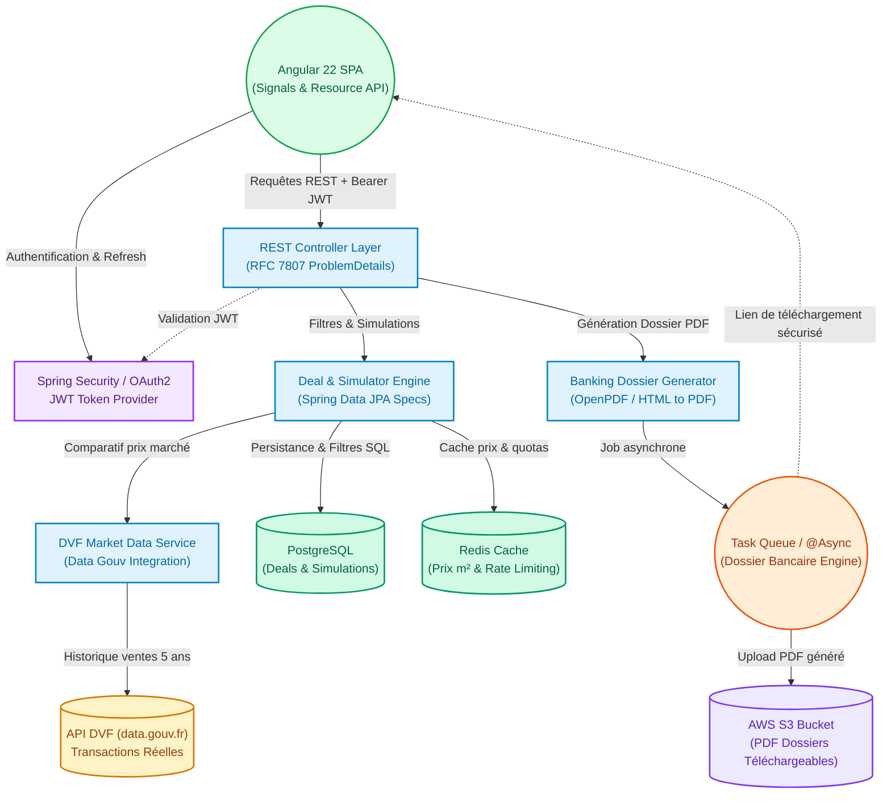

# 📋 Product Requirements Document (PRD) & Roadmap — ImmoRadar

> **Objectif** : Transformer le prototype initial d'**ImmoRadar** en un SaaS d'investissement immobilier à forte valeur ajoutée client et en un projet de référence technique démontrant un niveau **Ingénieur Senior / Tech Lead** (Java 25, Spring Boot 4.1, Angular 22, GraalVM, Cloud Serverless).

---

## 🏛️ Architecture Cible

---

## 🎯 1. Comment en faire un projet réellement utile pour des clients ?

Dans l'état actuel, les données sont statiques et les calculs sont trop simplifiés. Pour apporter une valeur monétisable à des investisseurs, chasseurs immobiliers ou conseillers en gestion de patrimoine, le SaaS doit devenir un **copilote d'aide à la décision et de financement**.

### 1.1 Intégration des données officielles de l'État (API DVF)
- [ ] **Connecteur API DVF (Demande de Valeur Foncière - data.gouv.fr)** : Récupérer automatiquement l'historique des ventes réelles des 5 dernières années dans un rayon de 500m autour du bien.
- [ ] **Indicateur de surévaluation / sous-évaluation** : Comparer le prix affiché au m² avec les prix réels notariés du quartier pour calculer la marge de négociation recommandée.
- [ ] **Score de liquidité & tension locative** : Calculer un indice de risque basé sur le ratio d'offre/demande et le délai moyen de vente dans la commune.

### 1.2 Moteur financier et fiscal expert (France)
- [ ] **Comparatif fiscal multi-régimes en temps réel** :
  - **LMNP au Réel** : Ventilation précise bâti (80-85%) / terrain (15-20% non amortissable), amortissement linéaire par composants, déduction des intérêts, travaux et frais de notaire.
  - **LMNP Micro-BIC** : Abattement forfaitaire 50% (ou 71% meublé tourisme classé).
  - **Revenus Fonciers (Location Nue)** : Micro-foncier vs Régime réel avec imputation du déficit foncier (plafond 10 700 €/an).
  - **SCI à l'IS** : Calcul de l'IS (taux réduit 15% jusqu'à 42 500 €, puis 25%) et flat tax (30%) en cas de distribution de dividendes.
- [ ] **Profil fiscal investisseur** : Intégration de la Tranche Marginale d'Imposition (TMI : 0%, 11%, 30%, 41%, 45%) et des prélèvements sociaux (17.2%).
- [ ] **Dépenses réelles exhaustives** : Taxe foncière, assurance PNO (Propriétaire Non Occupant), GLI (Garantie Loyers Impayés), provisions pour vacance locative (ex: 1 mois tous les 2 ans), frais de gestion d'agence (6-8%).

### 1.3 Générateur de « Dossier Bancaire » PDF (La Killer Feature B2C/B2B)
- [ ] **Template PDF professionnel prêt pour le courtier/banquier** :
  - Page de garde et fiche synthétique du bien (photos, caractéristiques, localisation).
  - Plan de financement : apport, montant emprunté, frais de notaire estimés, garanties bancaires.
  - Tableau d'amortissement prévisionnel et courbe de trésorerie sur 20 ou 25 ans.
  - Compte de résultat prévisionnel (TRI - Taux de Rentabilité Interne, VAN, Cashflow net mensuel).
- [ ] **Téléchargement immédiat et stockage cloud** avec URL sécurisée temporaire (S3 presigned URL).

### 1.4 Import rapide d'annonces par URL
- [ ] **Analyseur d'annonces en 1 clic** : Permettre à l'utilisateur de coller un lien (ex: Leboncoin, SeLoger, PAP, Bien'ici) pour préremplir instantanément la surface, le prix, la ville et calculer la rentabilité sans saisie manuelle.

---

## 💼 2. Que faut-il ajouter pour que ça impressionne un recruteur ?

Une belle interface ne suffit pas à convaincre un recruteur technique (Tech Lead / Engineering Manager). Ce qui prouve la séniorité, c'est **la rigueur architecturale, la sécurité, la testabilité et la maîtrise du Cloud/DevOps**.

### 2.1 Backend : Spring Boot 4.1 & Java 25 (Excellence & Clean Code)
- [ ] **Architecture en couches & Clean Architecture** : Découpage strict `domain`, `application`, `infrastructure`, `web`.
- [ ] **Java 25 Records & DTOs** : Éliminer l'exposition directe des entités JPA. Utiliser des `record` immutables pour les requêtes (`SimulationRequest`) et réponses (`DealResponseDto`).
- [ ] **Spring Data JPA Specifications & Pagination** :
  - Remplacer le `findAll().stream().filter(...)` par une API paginée (`Pageable`, `Page<Deal>`).
  - Implémenter des critères de recherche dynamiques avec `Specification<Deal>` (exécutés directement en SQL indexé).
- [ ] **Gestion standardisée des erreurs (RFC 7807)** : Utilisation de `ProblemDetail` via un `@RestControllerAdvice` global retournant des codes HTTP sémantiques et des messages typés.
- [ ] **Validation stricte (Bean Validation)** : Annotations `@Valid`, `@NotNull`, `@Positive`, `@Pattern` sur tous les endpoints d'entrée.
- [ ] **Tests automatisés de haut niveau** :
  - Tests unitaires des moteurs de calcul financier (JUnit 5 + AssertJ).
  - Tests d'intégration avec **Testcontainers** (PostgreSQL) pour valider les requêtes JPA sur un vrai moteur relationnel.

### 2.2 Frontend : Angular 22 & UI Haut de Gamme
- [ ] **Architecture réactive moderne** : Exploitation complète des Signals (`signal`, `computed`, `linkedSignal`, `resource`).
- [ ] **Visualisation de données avancée** : Intégration de graphiques financiers réactifs (Chart.js / ngx-charts / ApexCharts) :
  - Barres empilées : Amortissement du capital vs Intérêts vs Impôts.
  - Évolution du patrimoine net et de la trésorerie cumulée sur 25 ans.
- [ ] **Formulaires réactifs typés** : Validation temps réel sur l'apport, le taux d'usure, et alertes sur le taux d'endettement (> 35%).
- [ ] **Tests End-to-End (E2E) Playwright** :
  - Test 1 : Parcours de recherche et filtrage de deals.
  - Test 2 : Ajustement de simulation de crédit et validation de la mise à jour du cashflow.
  - Test 3 : Déclenchement de la génération d'un rapport PDF.

### 2.3 Sécurité, Multi-tenancy & Résilience
- [ ] **Spring Security + JWT stateless** : Inscription, connexion, refresh tokens, sécurisation des routes `/api/users/**`, `/api/simulations/**`.
- [ ] **Isolation des données utilisateur** : Chaque utilisateur ne peut accéder qu'à ses propres simulations et deals sauvegardés.
- [ ] **Rate Limiting (Bucket4j / Redis)** : Protection des endpoints d'API contre les abus et limitation des calculs lourds (génération PDF).

### 2.4 Cloud, DevOps & IaC (Exploitation du dossier `cloud/`)
- [ ] **Compilation Native GraalVM** : Valider le build natif Spring Boot 4.1 pour obtenir un binaire exécutable démarrant en < 50ms avec une empreinte RAM minimale (< 80 Mo).
- [ ] **Infrastructure as Code (IaC)** dans [cloud/](file:///c:/Users/Hugo/Documents/ImmoManager/cloud) :
  - Script **Terraform** ou **AWS CDK** définissant l'infrastructure : API Gateway, AWS Lambda (Serverless Container), base PostgreSQL managée (RDS / Supabase), Bucket S3.
- [ ] **Pipeline CI/CD GitHub Actions** :
  - Job Frontend : Lint, build de production, tests Vitest, tests E2E Playwright en headless.
  - Job Backend : Maven build, vérification du code style, exécution des tests JUnit/Testcontainers.
  - Déploiement automatique sur environnement de staging / démo accessible en ligne.

---

## 🚀 3. Plan d'action recommandé en 3 phases

Ce découpage progressif permet de livrer des incréments de valeur sans s'éparpiller :

### 🟢 Phase 1 : Rigueur Architecturale, Moteur Fiscal & Données Marché
*Priorité : Poser les fondations techniques professionnelles et fiabiliser la donnée métier.*

- [ ] **[Backend]** Remplacer le filtrage mémoire par `DealRepository extends JpaSpecificationExecutor<Deal>` et pagination `Pageable`.
- [ ] **[Backend]** Créer les DTOs `record` pour découpler les modèles d'API des entités de persistance.
- [ ] **[Backend]** Implémenter le service de calcul fiscal complet (LMNP réel détaillé avec ventilation terrain/bâti, micro-BIC, foncier nu, SCI IS).
- [ ] **[Backend]** Développer le client HTTP pour interroger l'API officielle DVF (`api.gouv.fr`) et cacher les résultats moyens au m² par commune/quartier.
- [ ] **[Frontend]** Afficher le comparatif du bien par rapport au prix médian DVF du secteur (badge négociation conseillée).
- [ ] **[Tests]** Écrire la suite de tests unitaires sur les calculs fiscaux et financiers.

---

### 🟡 Phase 2 : La Killer Feature — Dossier Bancaire & Data Visualisation
*Priorité : Créer l'effet "WOW" fonctionnel et visuel aussi bien pour les utilisateurs que pour les recruteurs.*

- [ ] **[Backend]** Développer le service de génération de PDF (`OpenPDF` ou template HTML vers PDF) avec graphiques et tableaux d'amortissement.
- [ ] **[Backend]** Mettre en place un traitement asynchrone (`@Async` / `CompletableFuture`) pour la génération du dossier bancaire.
- [ ] **[Frontend]** Intégrer des graphiques interactifs (Chart.js / ApexCharts) dans le composant de simulation (projection de trésorerie sur 20 ans).
- [ ] **[Frontend]** Ajouter le bouton d'export avec indicateur de progression et téléchargement direct du PDF.
- [ ] **[Tests]** Mettre en place 2 parcours de tests E2E Playwright couvrant la simulation et l'export PDF.

---

### 🔵 Phase 3 : Sécurité, Cloud Serverless & CI/CD Production
*Priorité : Démontrer la maîtrise DevOps, Cloud Native et la capacité de mise en production.*

- [ ] **[Backend]** Intégrer Spring Security 6+ avec authentification JWT stateless.
- [ ] **[Backend]** Ajouter les entités `User` et `SavedSimulation` pour permettre la sauvegarde et l'historique des projets.
- [ ] **[Cloud]** Écrire le template IaC dans `cloud/` (Terraform ou AWS CDK) pour l'API Gateway, AWS Lambda et S3.
- [ ] **[DevOps]** Mettre en place le pipeline CI/CD GitHub Actions (.github/workflows) : tests automatisés + build Docker / GraalVM Native Image.
- [ ] **[Documentation]** Rédiger un README racine percutant avec badges CI/CD, capture d'écran du dashboard, lien vers la démo live et instructions d'exécution en local (`docker compose up`).

---

## 📊 Tableau de bord d'avancement global

| Domaine | Statut Actuel | Cible Recruteur / Client | Progression |
| :--- | :--- | :--- | :--- |
| **Backend & Architecture** | Prototype SQLite, filtrage mémoire | Java 25, Specs JPA, DTO Records, RFC 7807 | `[==--------] 20%` |
| **Moteur Métier & Fiscalité** | Calculs basiques approximatifs | Moteur LMNP/SCI complet + Données DVF réelles | `[=---------] 10%` |
| **Dossier Bancaire PDF** | Inexistant | Export PDF charté 1-clic avec tableaux 25 ans | `[----------] 0%` |
| **Frontend & UX** | Angular 22 propre avec Signals | Graphiques financiers réactifs, formulaires validés | `[====------] 40%` |
| **Sécurité & Multi-tenant** | Aucune auth | Spring Security, JWT, isolation des données | `[----------] 0%` |
| **Cloud, DevOps & Tests** | Playwright & Vitest installés, cloud/ vide | IaC AWS/Terraform, Testcontainers, CI/CD | `[=---------] 10%` |
