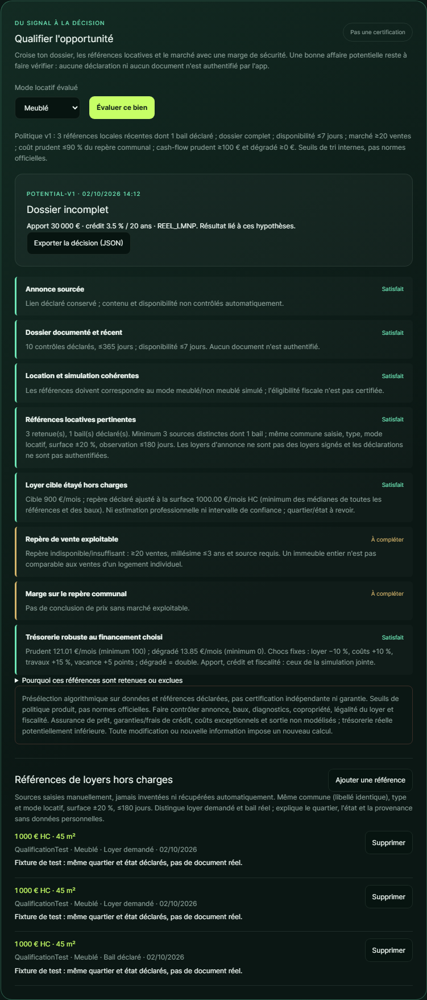

# Qualifier une bonne affaire potentielle

La fonctionnalité « Qualifier l'opportunité » est une **présélection explicable**, pas une certification. Elle ne vérifie pas automatiquement les documents ou le contenu des liens et ne garantit ni rendement ni possibilité de louer. La réponse contient toujours `certified: false`, même lorsque toutes les règles sont satisfaites.

## Parcours

1. Créer un bien avec son annonce source HTTPS. Les cinq exemples du catalogue ne sont jamais qualifiables.
2. Documenter les dix contrôles dans « Fiabilité du dossier » : prix, surface, loyer, charges, taxe, travaux, DPE, copropriété, demande locale et disponibilité.
3. Ajouter les références locatives consultées, sans données personnelles : URL, date, commune, type, surface, mode meublé/non meublé, loyer **hors charges**, contexte. Distinguer loyer demandé et loyer d'un bail réel ; les deux restent des déclarations à vérifier.
4. Régler le financement et la fiscalité simplifiée, choisir le mode locatif évalué et cliquer sur « Évaluer ce bien ».
5. Lire chaque motif, les références exclues et les limites. Exporter le JSON pour conserver les valeurs et sources utilisées à cet instant. Le PDF financier existant ne contient pas cette qualification.

Toute modification du financement, du mode locatif, du bien sélectionné, des références ou des justificatifs enregistrés depuis cette page invalide le résultat affiché. Une réponse en vol correspondant à d'anciennes hypothèses est ignorée. Les écritures des autres sessions et le simple passage du temps ne déclenchent pas une actualisation automatique : relancer l'évaluation avant toute décision.

## Politique `potential-v1`

Ce sont des **heuristiques produit**, choisies pour un premier filtre conservateur. Aucun de ces seuils n'est une norme de certification ni une recommandation officielle d'investissement.

| Critère | Condition |
| --- | --- |
| Annonce | URL HTTPS syntaxiquement valide ; ni identifiant d'exemple ni titre marqué fictif. Le lien n'est pas consulté par ce calcul. |
| Dossier | Dix contrôles complets, sans valeur obsolète, datés de 365 jours maximum ; disponibilité de 7 jours maximum. Une copropriété explicitement non applicable est acceptée. |
| Mode locatif | NU ↔ non meublé ; LMNP/Micro-BIC ↔ meublé. SCI IS accepte les deux. Ce rapprochement ne vérifie pas les autres conditions d'éligibilité fiscale. |
| Références de loyer | Au moins trois sources distinctes retenues, dont un bail déclaré ; même commune saisie (accents/casse/espaces normalisés), même type et mode, surface ±20 %, observation de 180 jours maximum. |
| Loyer cible | Ne dépasse pas le minimum entre la médiane €/m² des références retenues et celle des seuls baux déclarés, multiplié par la surface du bien. Aucun loyer n'est imputé quand l'échantillon manque. |
| Repère de vente | Marché disponible, médiane positive, au moins 20 ventes, année entre l'année courante moins trois et l'année courante, URL source. L'agrégat communal via FoncierData n'est pas une expertise du bien. |
| Marge de prix | Coût prudent (achat + frais de notaire forfaitaires 7,5 % + travaux majorés) ≤90 % du repère communal multiplié par la surface. Ce n'est pas une décote locale prouvée. |
| Robustesse | Cash-flow prudent ≥100 €/mois et dégradé ≥0 €/mois, pour l'apport, le crédit et le régime choisis. |

Les chocs de qualification sont imposés **côté serveur** : loyer −10 %, charges/taxe/assurance +10 %, travaux +15 %, vacance +5 points. Le dégradé double ces chocs. Les curseurs du test de robustesse exploratoire ne les modifient pas. Un budget nul reste nul après majoration ; un devis et des dépenses réalistes restent indispensables.

Un critère en échec donne « Critères non satisfaits », même si d'autres informations manquent. En l'absence d'échec mais avec une information requise manquante, le résultat est « Dossier incomplet ». Seul un ensemble de critères satisfaits donne « Bonne affaire potentielle ».

Les URL identiques à domaine/port/chemin équivalents sont dédoublonnées ; paramètres, fragments et slash final sont ignorés. C'est volontairement restrictif : un portail qui identifie ses annonces uniquement par un paramètre ne fournit pas trois sources distinctes pour cette politique. Aucun téléchargement du lien n'est effectué. Une même annonce republiée sur plusieurs URL ou plusieurs portails n'est pas détectée : l'utilisateur doit éviter ces faux comparables. Maximum 20 références enregistrées par bien ; supprimer une erreur et saisir la référence corrigée.

## Provenance et limites

DVF décrit des **ventes enregistrées**, pas un marché de loyers : [présentation officielle DVF](https://cadastre.data.gouv.fr/dvf). Les OLL collectent notamment les loyers hors charges et les caractéristiques des logements, avec contrôles méthodologiques ; leurs résultats statistiques diffusés reposent sur au moins 50 logements : [méthode du réseau des observatoires](https://www.observatoires-des-loyers.org/decouvrir-le-reseau/a-propos-des-donnees). Le petit échantillon manuel de cette fonctionnalité **n'a pas ce niveau de représentativité**. Aucune intégration OLL automatique n'est revendiquée.

Les références manuelles peuvent être erronées ou falsifiées. Quartier, nombre de pièces, état, équipements, stratégie (colocation, saisonnier…), restrictions locatives et légalité du loyer ne sont pas contrôlés par les rapprochements numériques. Les déclarations DPE/copropriété ne remplacent pas une revue des diagnostics, du règlement et des procès-verbaux. Un lien vers un document ne prouve pas son authenticité.

La fiscalité est simplifiée. Assurance emprunteur, garanties/frais de crédit, coûts exceptionnels et sortie ne sont pas modélisés ; le cash-flow réel peut être inférieur. Un apport élevé améliore la trésorerie sans démontrer que l'usage du capital est optimal. La qualification dépend de ce financement et ne prouve ni une capacité bancaire ni une rentabilité future.

L'export JSON contient le bien, les hypothèses, la version de politique, l'horodatage, les contrôles, les références retenues/exclues, le marché et les trois scénarios. Il n'est **ni signé ni immuable**, n'est pas stocké comme certificat côté serveur et ne permet pas de certifier a posteriori un document. Les références et contrôles sont persistés ; l'évaluation se recalcule sur leurs valeurs actuelles.

## Vérifications

- Tests Java : qualification positive sur fixtures explicitement fictives et marché simulé, critères de refus/manque, doublons, fraîcheur, type/surface/mode, loyers demandés élevés, refinancement, chocs fixes, validation HTTP, persistance/relecture/suppression et nouvelle évaluation après suppression.
- Tests Angular : évaluation explicite, invalidation après financement/justificatifs, rejet d'une réponse obsolète, panne API et formulaire incomplet/invalide.
- Playwright full-stack : références saisies via Angular, persistance Spring/SQLite isolée, dossier complet qui reste incomplet sans repère de marché, export JSON réel, invalidation, rechargement et suppression. Seule la consultation du panneau marché est remplacée ; le calcul de qualification serveur ne l'est pas. Le cas immeuble rend volontairement le marché serveur indisponible, sans dépendance réseau.

## Pour progresser vers une revue indépendante

- [x] Qualification déclarative traçable et versionnée ; pas de faux certificat.
- [x] Références locatives structurées persistées et motifs d'exclusion visibles.
- [x] Décision exportable avec valeurs, provenance et hypothèses.
- [ ] Source locative autorisée, plus représentative, segmentation de quartier/pièces/état et contrôle des doublons réels.
- [ ] Pièces jointes, versions, contrôle de cohérence et revue humaine identifiée.
- [ ] Comparables de vente fins ; estimation professionnelle et contrôle réglementaire de la location.
- [ ] Calcul financier complet, financement documenté et hypothèses fiscales relues.
- [ ] Historique signé/inaltérable, identité et autorisations des réviseurs, expiration et actualisation intersessions.

L'API reste destinée à un usage local sans authentification ; ne pas y stocker ni publier de documents personnels sensibles et ne pas l'exposer publiquement telle quelle.
