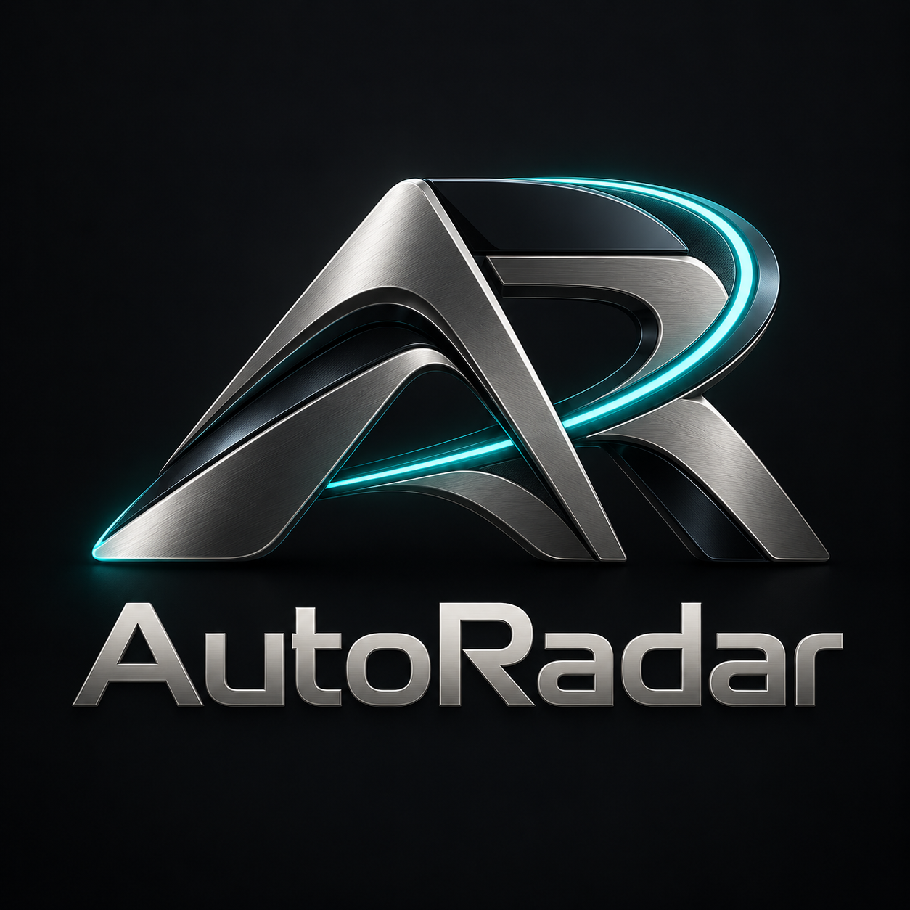
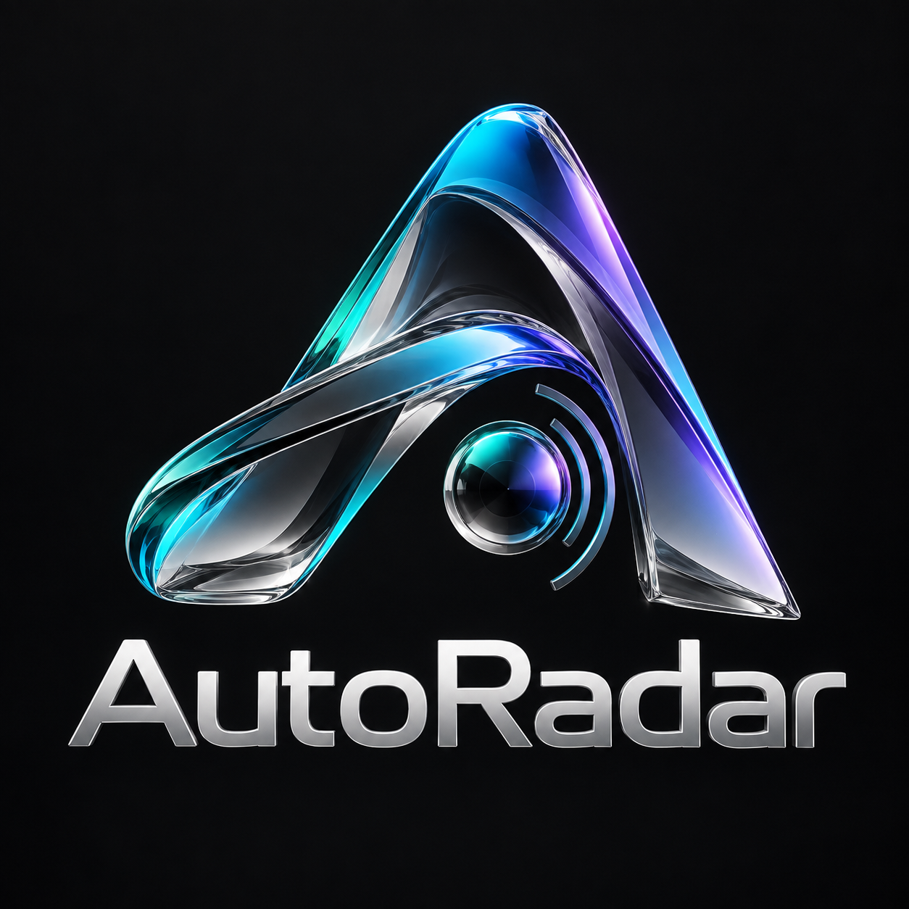
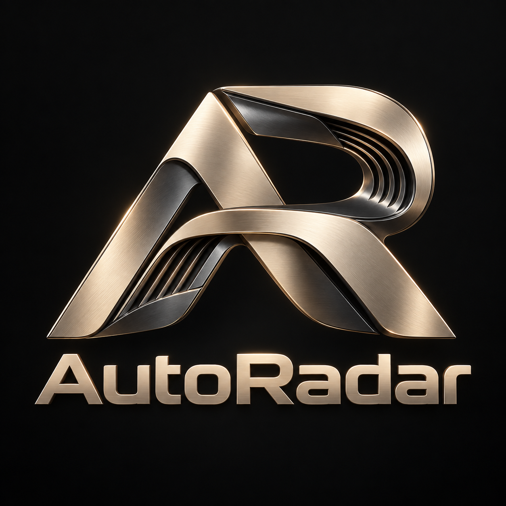
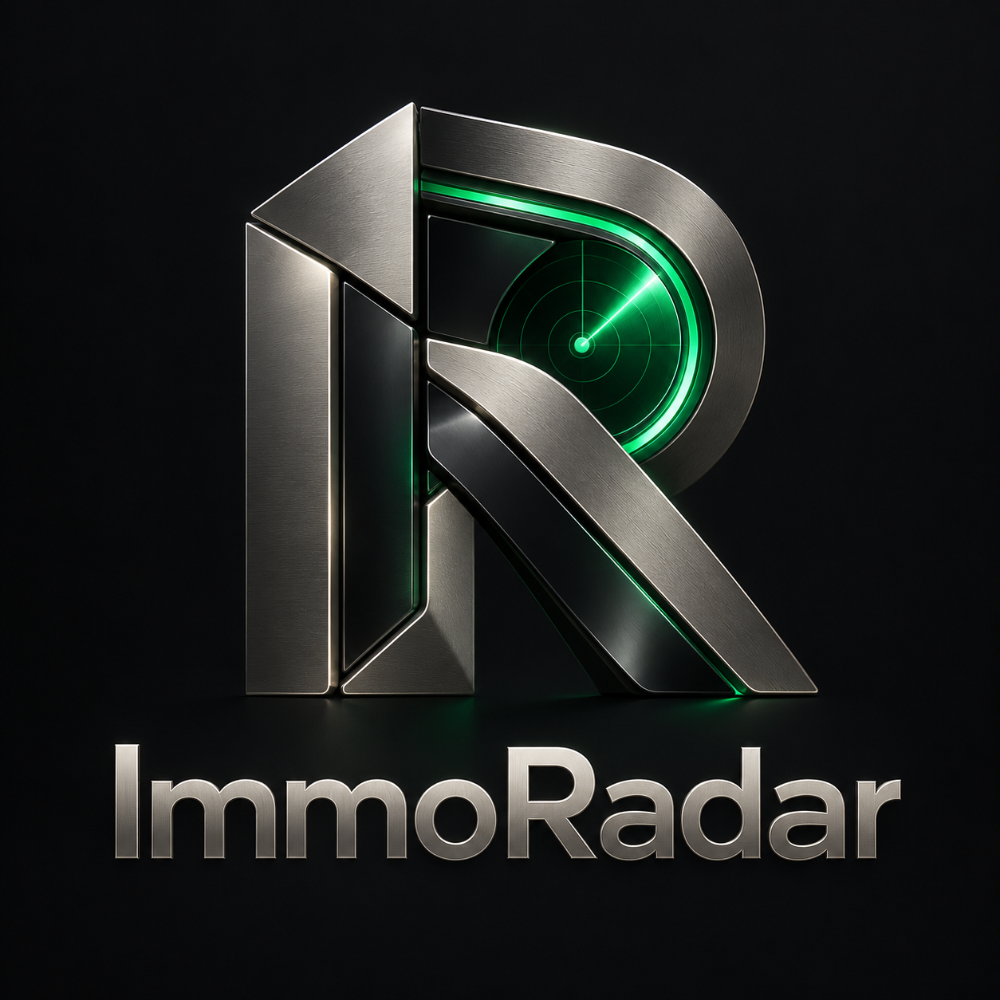
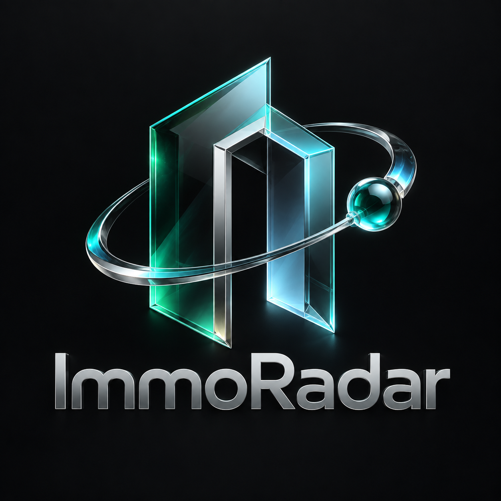
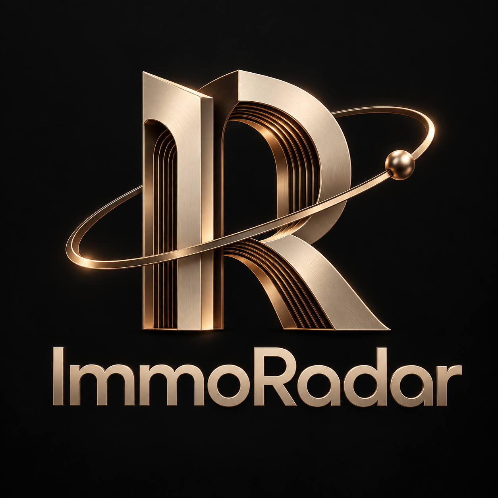

# AutoRadar & ImmoRadar — sélection premium

Six pistes de logo générées le 2 octobre 2026 avec l’outil de génération d’images intégré. Chaque piste travaille le volume, les matières et les reflets plutôt qu’un pictogramme vectoriel plat.

Ces PNG sont des **présentations sur fond sombre**, pas des exports transparents. Les logos actuellement intégrés à l’application ne sont pas remplacés. Après choix d’une piste : déclinaisons transparentes, horizontales, emblème seul, variantes pour fond clair/sombre et contrôle de lisibilité en petit format. Aucune recherche d’antériorité de marque n’a été réalisée.

## AutoRadar

### A1 — Obsidian

### A2 — Aurora

### A3 — Signature

## ImmoRadar

### I1 — Obsidian

### I2 — Aurora

### I3 — Signature

## Intentions

- Obsidian : titane brossé, céramique sombre et lumière radar intégrée ; orientation technologique.
- Aurora : verre optique, chrome et reflets colorés ; orientation expressive et futuriste.
- Signature : titane champagne, faces satinées et détails usinés ; orientation luxe sobre.

Les prompts complets sont conservés dans [prompts.md](prompts.md).

